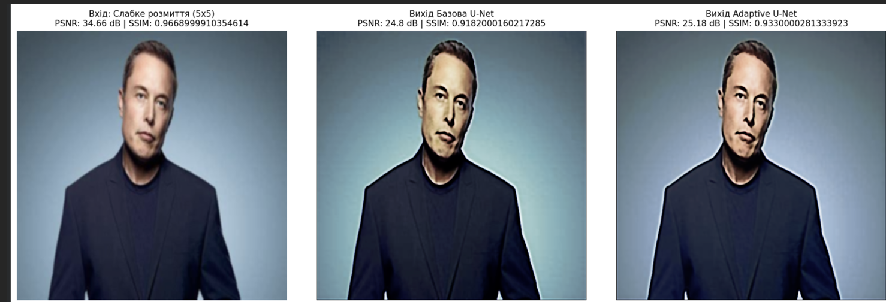
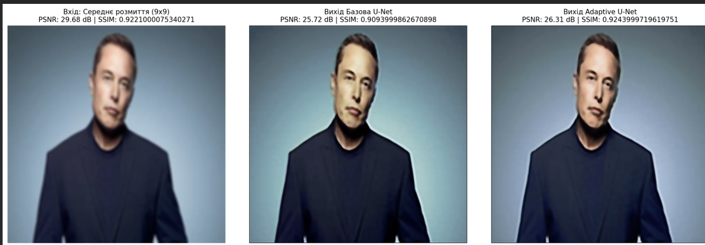
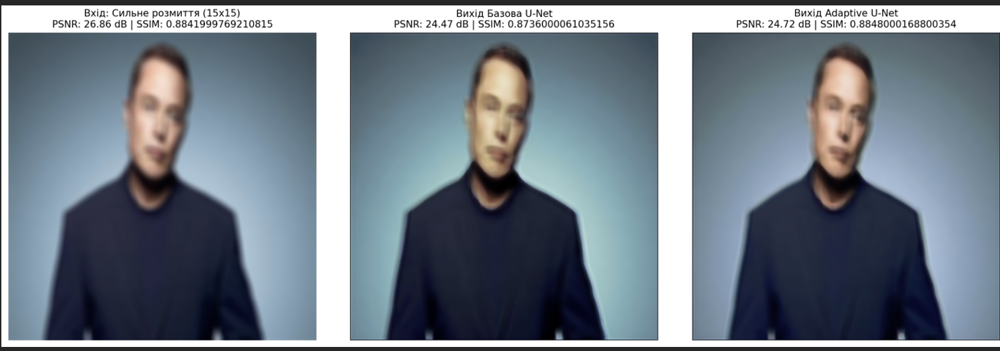

# diploma_Myhailova_Yana

# 📘 Дослідження ефективності U-net та Adaptive U-net нейромереж при відновленні якості спотворених зображень

---

## 👤 Автор

- **ПІБ**: Михайлова Яна Олексіївна
- **Група**: ФеП-42
- **Керівник**: д.ф. О.Б. ІЖИК
- **Дата виконання**: [25.05.2026]

---

## 📌 Загальна інформація

- **Тип проєкту**: Вебсайт
- **Мова програмування**: Python 3 
- **Фреймворки / Бібліотеки**: PyTorch, Torchvision, OpenCV (cv2), Scikit-Image, Pandas, Matplotlib

---

## 🧠 Опис функціоналу

- 🖼️ **Динамічний конвеєр даних:** автоматичне завантаження, масштабування та випадкове кропування патчів 256х256 пікселів.
- 🌫️ **Симуляція деградації кадру:** інтегроване накладання розмиття Гаусса для створення парних навчальних вибірок «на льоту».
- 🔬 **Дві обчислювальні моделі:** базова модель `UNetResizeConv` (з Resize-Convolution для усунення шахових артефактів) та модифікована `AdaptiveUNet` (з блоками поканальної уваги Squeeze-and-Excitation).
- 📉 **Автоматичне логування:** фіксація графіків збіжності функцій втрат (MAE) та експорт історій навчання у формат `.csv`.
- 🧩 **Алгоритм безшовного тайлингу:** сегментація повнорозмірних кадрів на вікна, їх паралельна обробка та збирання без утворення крайових швів.
- 📊 **Оцінка якості:** розрахунок об'єктивних комп'ютерних метрик $PSNR$ та $SSIM$, побудова теплових карт похибок (Error Heatmaps).
---

## 🧱 Опис основних класів / файлів

| Клас / Файл / Об'єкт | Призначення                                                                   |
|----------------------|-------------------------------------------------------------------------------|
| `FaceBlurDataset`    | Клас конвеєра даних, генерація пар «заблюрений вхід — оригінал»               |
| `UNetResizeConv`     | Базова модель U-Net з інтерполяційним апсемплінгом                            |
| `AdaptiveUNet`       | Модифікована модель U-Net з інтегрованими блоками поканальної уваги           |
| `AdaptiveSEBlock`    | Блок Squeeze-and-Excitation для розрахунку коефіцієнтів важливості каналів    |
| `train_loader`       | Завантажувач пакетів даних для тренування (batch_size=16, `shuffle=True`)     |
| `val_loader`         | Завантажувач пакетів для валідаційного контролю (batch_size=4).               |
| `criterion`          | Функція втрат середньої абсолютної похибки (`nn.L1Loss()`)                    |
| `optimizer`          | Адаптивний оптимізатор ваг `optim.Adam` з ковзаючими моментами                |
---

## ▶️ Як запустити проєкт "з нуля"

### 1. Встановлення інструментів

Рекомендується використовувати хмарну інфраструктуру **Google Colab** з активованим апаратним прискоренням (GPU NVIDIA T4 / V100) та підключеним Google Диском.

### 2. Клонування репозиторію

Створіть директорію на Google Диску або локально в Colab та завантажте туди оригінальні чіткі зображення:
python
FACE_DATA_DIR = '/content/ВАША ПАПКА' 

(https://www.kaggle.com/datasets/anku5hk/5-faces-dataset/data)

### 3. Запуск

# 1. Підключення середовища розгортання
Запустіть перші комірки ноутбука для підключення Google Диска та активації GPU прискорювача.
Запустити комірку для розмиття завантажених зображень (FaceBlurDatase)

# 2. Тренування базової архітектури U-Net
Запустіть комірки з функцією тренування для `UNetResizeConv` та наступну комірку для початку навчання моделі.

# 3. Тренування модифікованої архітектури Adaptive U-Net
Запустіть комірки з функцією тренування для `AdaptiveUNet` та наступну комірку для початку навчання моделі.
(AdaptiveSEBlock -> AdaptiveDoubleConv -> AdaptiveUNet)

# 4. Запуск фінального тестування моделей
Запустіть фінальну комірку стрес-тесту для автоматичного розрахунку метрик PSNR/SSIM та виведення графіків порівняння.

---

## 🔌  Приклади виклику моделей

# Завантаження базової архітектури U-Net
base_model = UNetResizeConv(in_channels=3, out_channels=3).to(device)

# Завантаження модифікованої архітектури Adaptive U-Net
adaptive_model = AdaptiveUNet(in_channels=3, out_channels=3).to(device)

### 📋 Нотатки

# Розрахунок PSNR (дБ)
psnr_value = psnr_metric(original_np, restored_np, data_range=1.0)

# Розрахунок SSIM
ssim_value = ssim_metric(original_np, restored_np, data_range=1.0, channel_axis=-1)

---

## 🖱️ Інструкція для користувача

Етап 1: Налаштування середовища та завантаження даних
Відкрийте файл ноутбука .ipynb у середовищі Google Colab.
У верхньому меню оберіть Змінити ➔ Налаштування блокнота та переконайтеся, що як апаратний прискорювач обрано T4 GPU (або інший доступний графічний процесор).
Запустіть першу комірку для підключення Google Диска та завантаження архіва з оригінальними зображеннями у папку /content/ВАША ПАПКА.

Етап 2: Ініціалізація та запуск навчання моделей
Запустіть комірку з визначенням класів моделей (UNetResizeConv, AdaptiveUNet) та конвеєра даних.
Виконайте комірку тренування для базової моделі U-Net (тривалість навчання: 75 епох).
Виконайте комірку тренування для модифікованої моделі Adaptive U-Net з блоками поканальної уваги (тривалість навчання: 75 епох).

Етап 3: Проведення фінального стрес-тестування
Запустіть останню комірку валідації. 
Програма автоматично візьме тестове зображення, накладе на нього три рівні розмиття (5х5, 9х9, 15х15), пропустить через обидві навчені мережі та виведе на екран: Порівняльну таблицю з розрахованими метриками PSNR та SSIM.
Графічні колажі для візуальної оцінки якості деблюрингу портрета.

---

## 📷 Приклади / скриншоти

Зведена таблиця об'єктивних метрик якості
| Рівень розмиття         | Вхід PSNR (dB) | Вхід SSIM | U-Net PSNR (dB) | U-Net SSIM | Adaptive U-Net PSNR (dB) | Adaptive 
| ----------------------- | -------------: | --------: | --------------: | ---------: | -----------------------: | ---------
| Слабке розмиття (5×5)   |          34,66 |    0,9669 |           24,80 |     0,9182 |                    25,18 |  0,9330 |
| Середнє розмиття (9×9)  |          29,68 |    0,9221 |           25,72 |     0,9094 |                    26,31 |  0,9244 |
| Сильне розмиття (15×15) |          26,86 |    0,8842 |           24,47 |     0,8736 |                    24,72 |  0,8848 |

Колаж візуального порівняння

---

## 🧪 Проблеми і рішення

| Проблема                                | Рішення                                                                         |
|-----------------------------------------|-------------------------------------------------------------------------------: |
| RuntimeError: CUDA out of memory (OOM)  |  Зменшити параметр batch_size у завантажувачі train_loader з 16 до 8 (або 4),   |
|                                         |  або виконати очищення кешу через torch.cuda.empty_cache().                     |
|-----------------------------------------|---------------------------------------------------------------------------------|
| ValueError: images must have the same   |  Перевірити, щоб у конвеєрі даних FaceBlurDataset обов'язково відпрацьовував  шар фіксованого кропування T.RandomCrop(patch_size),                               |                   | dimensions                              ||
|                                         |  який гарантує однаковий розмір усіх тензорів.                                  |
                         

---

| Технологія / Бібліотека    | Призначення у проєкті                                                                                                                                                                         |
| -------------------------- | --------------------------------------------------------------------------------------------------------------------------------------------------------------------------------------------- |
| **Python 3**               | Основна мова програмування, що використовується для реалізації алгоритмів обробки даних, навчання моделей та загальної логіки програмного продукту.                                           |
| **PyTorch (torch)**        | Фреймворк глибокого навчання, який використовується для побудови архітектур U-Net, обчислення градієнтів, налаштування функцій втрат та оптимізації параметрів нейронних мереж.               |
| **Torchvision**            | Бібліотека для роботи із зображеннями, що забезпечує виконання трансформацій даних, випадкового обрізання зображень (`RandomCrop`) та накладання ефекту розмиття за допомогою фільтра Гаусса. |
| **CUDA**                   | Технологія компанії NVIDIA для паралельних обчислень на графічному процесорі, яка значно прискорює навчання та тестування нейронних мереж.                                                    |
| **OpenCV (cv2)**           | Бібліотека комп’ютерного зору, що використовується для зчитування, збереження та попередньої обробки цифрових зображень.                                                                      |
| **Scikit-Image (skimage)** | Бібліотека для аналізу зображень, яка застосовується для обчислення метрик якості відновлення зображень, зокрема PSNR та SSIM.                                                                |
| **Pandas**                 | Інструмент для роботи з табличними даними, який використовується для збереження результатів навчання, ведення статистики та експорту даних у формат CSV.                                      |
| **Matplotlib**             | Бібліотека для візуалізації даних, що використовується для побудови графіків зміни функції втрат та відображення результатів роботи моделей у вигляді порівняльних зображень.                 |

